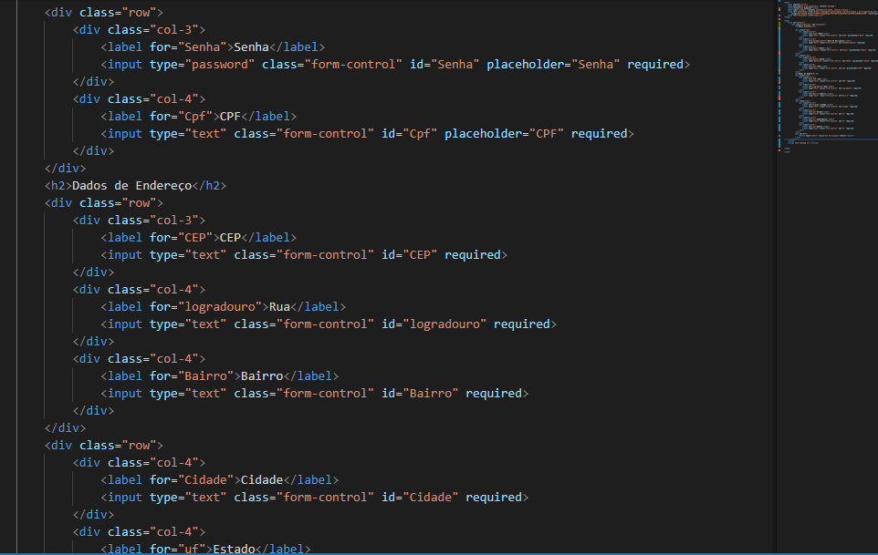

> # **FORMULÁRIO DE CADASTRO COMPLETO** 
-----------------------------------------------------------------------------------

Este projeto consiste em um formulário de cadastro completo, com validações e integração com uma API para preencher os campos de endereço. O formulário pode ser utilizado em plataformas de e-commerce e coleta as seguintes informações:

- Nome
- Email (com validação)
- Senha
- CPF (com validação)
- Data de Nascimento
- Endereço Completo (com consumo de API)

## **Estrutura do Projeto**

O projeto é composto por três arquivos principais:

1. **cad.html**: Estrutura HTML do formulário de cadastro.
2. **cad.css**: Estilos CSS para o layout da página.
3. **cadcomp.js**: JavaScript que contém as validações e interações do formulário.

## **Funcionalidade do Formulário**

O formulário é dividido em duas seções:

### 1. **Dados Pessoais**

- **Nome**: Campo de texto para o nome do usuário.
- **Data de Nascimento**: Campo de data para o nascimento do usuário.
- **Email**: Campo de e-mail com validação.
- **Senha**: Campo de senha para a criação de conta.
- **CPF**: Campo de CPF com validação.

### 2. **Dados de Endereço**

- **CEP**: Campo de CEP, que ao ser preenchido, realiza uma busca na API ViaCEP para preencher automaticamente os campos de endereço.
- **Rua**: Preenchido automaticamente pela API ViaCEP.
- **Bairro**: Preenchido automaticamente pela API ViaCEP.
- **Cidade**: Preenchido automaticamente pela API ViaCEP.
- **Estado (UF)**: Preenchido automaticamente pela API ViaCEP.
- **Complemento e Número***: Campos adicionais para informações complementares do endereço.

## **Explicação do Código**

### **CAD.HTML**

Este é o arquivo principal que contém a estrutura HTML do formulário.

Este código define a estrutura básica do formulário com o uso do framework *Bootstrap* para um layout responsivo.

### **CADCOMP.JS**

O arquivo JavaScript contém as funções para validar o formulário e interagir com a API ViaCEP.

#### 1. **Função de Validação do Email**

Esta função valida se o campo de *email* contém um formato válido. A função verifica se o e-mail inclui o símbolo @ e o ponto ..

#### 2. **Função de Validação do CPF**

A função de validação do *CPF* é bastante detalhada. Ela verifica se o CPF possui 11 dígitos e realiza a validação dos dois dígitos verificadores de acordo com a regra oficial do CPF.

#### 3. **Função de Validação do CEP**

A função *validarCEP* utiliza uma expressão regular para garantir que o CEP esteja no formato correto (12345-678 ou 12345678).

#### 4. **Integração com a API ViaCEP**

Esta parte do código escuta o evento *blur* no campo de *CEP*. Quando o usuário sai do campo, a função realiza uma requisição à API *ViaCEP* para preencher automaticamente os campos de *Rua*, *Bairro*, *Cidade* e *Estado*.

### **Submissão do Formulário**

Quando o formulário é enviado, as funções de validação são chamadas para garantir que todos os campos sejam preenchidos corretamente. Se alguma validação falhar, uma mensagem de erro será exibida e o envio do formulário será impedido.

## **Como Rodar o Projeto**

1. Clone o repositório:
   bash
   git clone https://github.com/seuusuario/formulario-cadastro.git
   
2. Abra o arquivo index.html em um navegador.
3. Preencha os campos e teste as validações.

## **Conclusão**

Este formulário de cadastro foi projetado para ser simples e funcional, com validações de dados e integração com uma API externa para preencher automaticamente os campos de endereço. A utilização de *Bootstrap* garante que o layout seja responsivo e adequado a diferentes tamanhos de tela.

----------------------------------------------------------------------------------------
#### **PROJETOS UTILIZADOS**

1. https://github.com/melissasp200/form-CadEndereco
2. https://github.com/melissasp200/login-cad
3. https://github.com/melissasp200/form-login

-------------------------------------------------------------------------------
*Por Melissa de Souza Pinto*